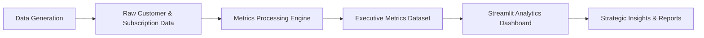

# SaaS Growth Analytics

A complete data analytics project that simulates, processes, and analyzes SaaS business metrics through an automated data pipeline and interactive dashboards.

The project replicates a real-world SaaS analytics environment by generating synthetic operational data, computing core SaaS KPIs, and presenting strategic insights through a Streamlit analytics platform.

The goal is to demonstrate how data pipelines and analytical frameworks can support strategic decision-making in subscription-based businesses.

---

## 1. Project Overview

This project presents a complete data analytics workflow designed to analyze the growth dynamics of a SaaS (Software as a Service) company.

The repository simulates the operational environment of a B2B SaaS platform by generating synthetic subscription and customer datasets, processing them through a structured data pipeline, and computing key business metrics used by SaaS companies to evaluate performance.

The project focuses on analyzing core indicators such as:

- Monthly Recurring Revenue (MRR)
- Customer churn and retention
- Net Revenue Retention (NRR)
- Customer Lifetime Value (LTV)
- Customer acquisition and expansion revenue

These metrics are integrated into an interactive analytics dashboard built with **Streamlit**, allowing users to explore the company's growth trajectory through multiple analytical perspectives including revenue dynamics, customer retention behavior, and strategic performance indicators.

The main goal of the project is to demonstrate how data engineering, analytics, and business intelligence practices can be combined to support strategic decision-making in subscription-based business models.

The solution includes a full analytics pipeline composed of:

- synthetic data generation
- metric computation framework
- structured data processing
- interactive visualization layer
- executive and strategic reporting

By combining technical implementation with business-oriented analysis, the project illustrates how modern analytics workflows can transform raw operational data into actionable insights for SaaS growth management.

---

## 2. Objective

The objective of this project is to design and implement a complete analytics workflow capable of analyzing the growth performance of a SaaS (Software as a Service) business.

The project focuses on building a structured data pipeline that simulates the operational environment of a subscription-based company. Through synthetic data generation and metric computation, the system produces a consistent dataset representing customer behavior, subscription dynamics, and revenue evolution over time.

Using this data foundation, the project aims to compute and analyze key SaaS performance indicators such as Monthly Recurring Revenue (MRR), customer churn, Net Revenue Retention (NRR), Average Revenue per User (ARPU), and Customer Lifetime Value (LTV).

The analytical results are then delivered through an interactive dashboard environment developed with Streamlit, enabling exploration of business performance across multiple perspectives including revenue dynamics, customer retention patterns, and overall growth trends.

From a technical perspective, the project seeks to demonstrate how data engineering practices, analytical modeling, and business intelligence visualization can be integrated into a coherent system for monitoring and interpreting SaaS growth metrics.

The expected outcome is a reproducible analytics environment that transforms operational data into structured metrics and visual insights capable of supporting strategic decision-making in subscription-based business models.

---

## 3. Business Context

Software-as-a-Service (SaaS) companies operate under a subscription-based revenue model where long-term growth depends heavily on customer retention, revenue expansion, and predictable recurring income.

Unlike traditional software businesses, SaaS performance cannot be evaluated solely through total revenue. Instead, companies rely on a specific set of operational metrics that describe how customers acquire, retain, expand, or churn over time. Metrics such as Monthly Recurring Revenue (MRR), Customer Churn Rate, Net Revenue Retention (NRR), and Customer Lifetime Value (LTV) are essential for understanding the sustainability of the business model.

In this context, companies require robust analytics systems capable of transforming operational data into actionable insights that support strategic decision-making.

This project simulates the analytical environment of a B2B SaaS company called **Nexora Analytics**, a platform that provides automated financial reporting and data analysis tools for small and medium-sized businesses. The company operates in a competitive subscription market where understanding growth dynamics and customer behavior is critical for long-term success.

The analytics workflow developed in this project aims to replicate the type of internal performance monitoring used by SaaS companies to track business health and guide strategic decisions.

The resulting analysis can support stakeholders such as:

- Product teams seeking to improve customer engagement and reduce churn
- Revenue and growth teams evaluating expansion opportunities
- Executives monitoring overall business performance
- Data teams responsible for building analytics infrastructure

By transforming raw subscription and customer data into structured metrics and interactive visualizations, the project demonstrates how data analytics can provide a clear view of business performance and support strategic planning within a SaaS environment.

---

## 4. Project Architecture

The project is structured as a modular analytics system designed to simulate the internal data workflow of a SaaS company. The architecture follows a pipeline-oriented approach where raw operational data is generated, processed into business metrics, and delivered through interactive analytics dashboards.

The solution is composed of four main layers:

### Data Generation Layer

The pipeline begins with a synthetic data generation module responsible for simulating the operational data of a subscription-based SaaS platform.

This component produces datasets representing:

- customer profiles
- subscription plans
- monthly subscription activity
- customer lifecycle events

The generated datasets replicate realistic SaaS dynamics such as customer acquisition, upgrades, churn events, and recurring revenue behavior.

---

### Data Processing Layer

Once generated, the raw datasets are processed through a metrics computation framework located in the `src/` module.

This stage is responsible for transforming operational data into structured SaaS performance indicators, including:

- Monthly Recurring Revenue (MRR)
- Customer churn rate
- Net Revenue Retention (NRR)
- Average Revenue per User (ARPU)
- Customer Lifetime Value (LTV)

The processing pipeline consolidates these metrics into an executive dataset used for analysis and visualization.

---

### Data Storage Layer

Processed outputs are stored in the `data/processed` directory as structured CSV files.

This layer acts as a persistence stage that separates raw operational data from analytical outputs, allowing the pipeline to maintain reproducibility and clear data lineage.

The main artifact generated in this stage is:

- `executive_metrics.csv`

This dataset becomes the foundation for both the analytical dashboards and the strategic reports.

---

### Analytics & Visualization Layer

The final layer of the architecture consists of an interactive analytics application built with **Streamlit**.

The application loads the processed datasets and exposes multiple analytical views organized into dedicated modules, including:

- Executive Overview
- Revenue Dynamics
- Growth Analysis
- Customer Retention
- Strategic Diagnosis

Each module focuses on a different aspect of SaaS performance, enabling users to explore revenue trends, customer behavior patterns, and strategic business indicators through interactive visualizations.

---

### Logical Data Flow

The complete workflow follows the sequence illustrated below:



This architecture separates data generation, metric computation, and visualization concerns, resulting in a clear, maintainable, and reproducible analytics pipeline.

---

## 5. Project Structure

The repository is organized to separate configuration, data processing, analytics logic, and visualization layers. This structure improves maintainability, reproducibility, and clarity when navigating the project.

Below is an overview of the main directories and their responsibilities:

```
saas-growth-analytics
│
├── config/
│   Configuration files used across the project, including environment
│   settings and centralized logging definitions.
│
├── data/
│   Data storage organized by processing stage.
│
│   ├── raw/
│   Raw operational data generated by the pipeline, including
│   synthetic customer and subscription datasets.
│
│   └── processed/
│   Processed analytical datasets used by the dashboards
│   and strategic analysis modules.
│
│
├── reports/
│   Written analytical outputs and strategic documentation
│   derived from the project analysis.
│
├── src/
│   Core pipeline implementation responsible for:
│   - synthetic data generation
│   - SaaS metric computation
│   - orchestration of the analytics pipeline.
│
├── streamlit_app/
│   Interactive analytics application built with Streamlit,
│   containing the dashboard interface and visualization modules.
│
├── tests/
│   Automated testing suite including unit and integration tests
│   to validate pipeline functionality and metric computations.
│
├── README.md
│   Project documentation and usage instructions.
│
├── README_EXECUTIVE.md
│   Executive-level project explanation intended for non-technical audiences.
│
├── requirements.txt
│   List of project dependencies.
│
└── LICENSE
    Project license information.
```

This structure separates the analytical pipeline from the visualization layer while maintaining clear data flow across the project. It also enables modular development, where each component can be maintained and tested independently.

---

## 6. Data Pipeline Stages

The analytics workflow implemented in this project follows a structured data pipeline designed to simulate how SaaS companies transform operational data into strategic insights.

The pipeline consists of multiple stages, each responsible for a specific part of the data lifecycle. Together, these stages convert raw subscription activity into actionable business metrics and interactive analytical outputs.

---

### 1. Synthetic Data Generation

The pipeline begins with a synthetic data generation process implemented in the `src/data_generation.py` module.

This stage simulates the operational environment of a subscription-based SaaS platform by generating realistic datasets that represent:

- customer profiles
- subscription plans
- monthly billing activity
- customer acquisition and churn events

The purpose of this stage is to create a controlled dataset that reproduces common SaaS growth patterns such as customer expansion, churn behavior, and recurring revenue fluctuations.

The resulting datasets are stored in the `data/raw` directory.

---

### 2. Data Preparation and Validation

After generation, the raw datasets are validated and prepared for analytical processing.

This stage ensures that the generated data follows the expected structure and that key fields required for metric computation are present and consistent.

Basic transformations may include:

- column validation
- formatting adjustments
- consistency checks between customers and subscriptions.

These steps ensure the reliability of downstream analytical computations.

---

### 3. SaaS Metrics Computation

The core analytical stage of the pipeline calculates key SaaS performance indicators using the processing functions implemented in `src/metrics.py`.

This stage derives business metrics from the operational data, including:

- Monthly Recurring Revenue (MRR)
- Customer churn rate
- Net Revenue Retention (NRR)
- Average Revenue per User (ARPU)
- Customer Lifetime Value (LTV)

The resulting metrics are consolidated into an executive dataset that summarizes the company's performance across time.

---

### 4. Processed Data Persistence

Once computed, the final analytical dataset is stored in the `data/processed` directory.

The primary output of this stage is:

- `executive_metrics.csv`

This dataset acts as the central data source for the visualization layer and strategic analysis reports.

By separating raw and processed data, the pipeline maintains clear data lineage and ensures reproducibility.

---

### 5. Analytics and Visualization Delivery

In the final stage, the processed dataset is loaded by the Streamlit analytics application located in the `streamlit_app` module.

The application presents the metrics through multiple analytical dashboards, including:

- Executive Overview
- Revenue Dynamics
- Growth Analysis
- Customer Retention
- Strategic Diagnosis

These dashboards allow users to explore revenue trends, customer behavior patterns, and strategic performance indicators through interactive visualizations.

Together, these stages form a complete analytics workflow that transforms raw operational data into structured insights for SaaS growth analysis.

---

## 7. Results Analysis

The analysis performed throughout the pipeline and dashboards reveals several key patterns in the simulated SaaS business performance.

Overall, the company demonstrates stable growth supported by a recurring revenue model and a growing customer base. Monthly Recurring Revenue (MRR) reaches approximately **$383K**, indicating a solid recurring revenue foundation typical of a mid-stage SaaS company.

Customer acquisition remains a primary driver of growth, with the platform reaching nearly **4,000 active customers** over the analyzed period. However, the data also suggests that the rate of customer acquisition begins to stabilize as the customer base grows, which is common as SaaS companies move from early expansion into a more mature growth phase.

Customer retention metrics remain within healthy industry benchmarks. The average **customer churn rate of approximately 3.5%** indicates a relatively stable customer base, although periodic churn fluctuations highlight the importance of strong onboarding and customer success strategies to maintain long-term retention.

Revenue expansion within the existing customer base appears present but limited. The **Net Revenue Retention (NRR) of roughly 103%** indicates that expansion revenue slightly offsets churn but does not yet represent a major driver of growth. High-performing SaaS companies often achieve NRR levels between 110% and 130%, suggesting potential opportunities for improved upselling and product expansion strategies.

The company's **Average Revenue per User (ARPU)** remains relatively stable at around **$96**, which contributes to a healthy **Customer Lifetime Value (LTV) of approximately $8.7K**. These metrics indicate that while the business maintains consistent revenue per customer, there may be opportunities to increase monetization through pricing optimization or feature-based upgrades.

Taken together, the results suggest that Nexora Analytics operates with a solid subscription foundation but is entering a phase where sustainable growth will depend less on pure customer acquisition and more on improvements in retention, expansion revenue, and customer value creation.

For a deeper strategic interpretation of these results, refer to the detailed analysis available in the `reports/` directory.

---

## 8. Technologies Used

This project combines data engineering, analytics processing, and interactive visualization tools to simulate a complete SaaS analytics workflow.

The main technologies used throughout the project are listed below.

---

### Programming Language

**Python**

Python is used as the primary language for implementing the data pipeline, metric computation logic, and integration between the different components of the analytics workflow.

---

### Data Processing and Analytics

- **Pandas**  
  Used for tabular data manipulation, metric aggregation, and analytical dataset preparation.

- **NumPy**  
  Used for numerical operations and synthetic data generation.

These libraries form the foundation of the project's analytical processing layer.

---

### Data Visualization

- **Streamlit**

Streamlit powers the interactive analytics application that allows users to explore SaaS performance metrics through a web-based dashboard interface.

The application includes multiple analytical views such as:

- Executive Overview
- Revenue Dynamics
- Growth Analysis
- Customer Retention
- Strategic Diagnosis

Custom CSS styling is also applied within Streamlit to enhance navigation and improve the user interface experience.

---

### Testing Framework

- **PyTest**

The project includes both **unit tests** and **integration tests** to validate core components of the pipeline, including:

- synthetic data generation
- SaaS metric computation
- pipeline orchestration logic

Automated testing helps ensure reliability and maintainability of the analytics workflow.

---

### Data Storage

- **CSV Files**

Data is stored in structured CSV files organized by processing stage:

- `data/raw` for generated operational data
- `data/processed` for analytical outputs

This approach keeps the pipeline simple and reproducible while preserving clear data lineage.

---

### Documentation and Visualization

- **Markdown**
- **Mermaid Diagrams**

Project documentation is written in Markdown, while Mermaid diagrams are used to visualize pipeline architecture directly within the repository documentation.

---

## 9. How to Run the Project

This project can be accessed in two different ways:

1. Through the hosted interactive dashboard
2. By running the project locally

---

### Option 1 — Access the Hosted Dashboard (Recommended)

The easiest way to explore the project is through the live Streamlit application hosted on **Streamlit Community Cloud**.

Access the dashboard here:

👉 **Live Demo:**  
https://saas-growth-analytics-project.streamlit.app

The application provides interactive access to all analytical modules, including:

- Executive Overview
- Revenue Dynamics
- Growth Analysis
- Customer Retention
- Strategic Diagnosis

This option requires no local installation.

---

### Option 2 — Run the Project Locally

If you want to run the project locally or explore the codebase, follow the steps below.

---

### 1. Clone the Repository

```bash
git clone https://github.com/eliassoul/data-analytics-portfolio.git
cd data-analytics-portfolio/saas-growth-analytics
```

### 2. Create a Virtual Environment

It is recommended to run the project inside a virtual environment.

```bash
python -m venv venv
```

Activate the environment:

**Windows**

```bash
.venv\Scripts\Activate.ps1
```

**Mac / Linux**

```bash
source .venv/Scripts/activate
```

### 3. Install Dependencies

Install the required Python packages using the provided requirements file.

```bash
pip install -r requirements.txt
```

### 4. Run the Data Pipeline

Execute the pipeline to generate synthetic data and compute SaaS metrics.

```bash
python -m src.run_pipeline
```

This will generate the following datasets:

- `data/raw/customers.csv`

- `data/raw/subscriptions_monthly.csv`

- `data/processed/executive_metrics.csv`

### 5. Launch the Streamlit Dashboard

Run the analytics application using Streamlit.

```bash
streamlit run streamlit_app/app.py
```

After launching, the dashboard will be available in your browser at:

```bash
http://localhost:8501
```

### Optional: Run the Test Suite

To validate the pipeline and metric computations, run the automated tests.

```bash
pytest
```

This will execute both unit and integration `tests/` located in the tests/ directory.

---

## 10. Next Steps

Although the current implementation provides a complete analytics workflow for SaaS growth analysis, several improvements could further expand the project's capabilities and realism.

Future developments may include the following enhancements.

---

### Integration with a Database Layer

Currently, the pipeline stores datasets as CSV files for simplicity and reproducibility. A natural extension would be the integration of a relational database such as:

- PostgreSQL
- DuckDB
- SQLite

This would allow more realistic data persistence and enable more complex analytical queries.

---

### Automated Pipeline Scheduling

The pipeline is currently executed manually through the `run_pipeline.py` script. Future versions could introduce automation using orchestration tools such as:

- Apache Airflow
- Prefect
- Dagster

This would simulate production-level data workflows with scheduled metric updates.

---

### Data Warehouse Modeling

Another improvement would be the implementation of a dimensional data model, organizing the analytical data into fact and dimension tables.

Examples could include:

- fact_revenue_metrics
- dim_customers
- dim_subscription_plans

This structure would better reflect modern analytics engineering practices.

---

### Advanced SaaS Metrics

Additional metrics could be introduced to deepen the business analysis, such as:

- Customer Acquisition Cost (CAC)
- LTV / CAC ratio
- Payback period
- Cohort-based retention analysis
- Revenue cohort analysis

These metrics are widely used by SaaS companies to evaluate growth efficiency.

---

### Dashboard Enhancements

The Streamlit application could be expanded with additional analytical capabilities, including:

- cohort retention visualizations
- forecasting models for revenue growth
- anomaly detection for churn spikes
- interactive scenario simulations.

---

### CI/CD Integration

Introducing a continuous integration workflow could improve development reliability by automatically executing tests and validating pipeline changes.

Platforms such as **GitHub Actions** could be used to automate testing and deployment of the analytics application.

---

## 11. Final Notes

This project was developed as an analytical case study designed to simulate the internal data environment of a SaaS company. The primary goal is to demonstrate how data engineering, analytics processing, and business intelligence tools can be combined to analyze subscription-based business performance.

All datasets used in this project are **synthetically generated**. The synthetic data generation process was designed to reproduce common SaaS business dynamics such as customer acquisition, subscription upgrades, churn behavior, and recurring revenue evolution. While the data aims to mimic realistic patterns, it does not represent any real company or proprietary dataset.

Because the data is simulated, certain simplifications were intentionally made in order to keep the project focused on analytics workflow design rather than production-level infrastructure complexity.

Some examples of these simplifications include:

- use of CSV files instead of a full database system
- synthetic generation of customer and subscription events
- simplified revenue modeling compared to real-world SaaS billing systems

Despite these simplifications, the project maintains a structure similar to real-world analytics environments, including:

- a modular data pipeline
- metric computation frameworks
- automated testing
- interactive analytical dashboards
- executive and strategic reporting layers

The project is intended to serve as a reproducible example of how modern analytics workflows can transform operational data into structured insights that support strategic decision-making in subscription-based business models.